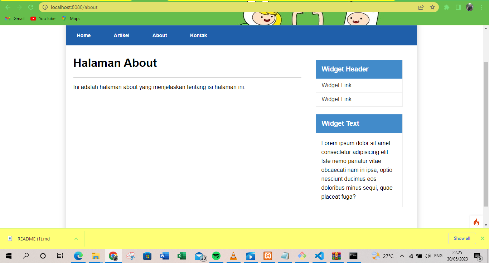

# Lab7Web
# Tugas Pemograman Web 2
## Profil
|Nama   : Muhamad Rifki |
|NIM    : 312******     |
|KELAS  : TI.21.A.1     |
## A. Persiapan 

Sebelum memulai menggunakan Framework Codeigniter, perlu dilakukan konfigurasi pada webserver. Beberapa ekstensi PHP perlu diaktifkan untuk kebutuhan pengembangan Codeigniter 4.

Berikut beberapa ekstensi yang perlu diaktifkan:

* **php-json** ekstension untuk bekerja dengan JSON;
* **php-mysqlnd** native driver untuk MySQL;
* **php-xml** ekstension untuk bekerja dengan XML;
* **php-intl** ekstensi untuk membuat aplikasi multibahasa;
* **libcurl** (opsional), jika ingin pakai Curl.

Untuk mengaktifkan ekstensi tersebut, melalui **XAMPP Control Panel**, pada bagian **Apache** klik **Config** -> **PHP(php.ini)**


Pada bagian extention, hilangkan tanda ; (titik koma) pada ekstensi yang akan diaktifkan. Kemudian simpan kembali filenya dan restart Apache web server.


## B. Installasi Codeigniter 4

Untuk melakukan instalasi Codeigniter 4 dapat dilakukan dengan dua cara, yaitu cara **manual** dan menggunakan **composer**. Pada praktikum ini kita menggunakan cara manual.

* Unduh Codeigniter dari website [Codeigniter](https://codeigniter.com/download).
* Extrak file zip Codeigniter ke direktori **htdocs/lab7_ci**.
* Ubah nama direktory **framework-4.x.xx** menjadi **ci4**.
* Buka browser dengan alamat http://localhost/lab7_ci/ci4/public/ 


## C. Menjalankan CLI

1. Codeigniter 4 menyediakan CLI untuk mempermudah proses development. Untuk mengakses CLI buka terminal/command prompt pada xampp.

2. Arahkan lokasi direktori sesuai dengan direktori kerja project dibuat **(xampp/htdocs/lab7_ci/ci4/)**.

3. Perintah yang dapat dijalankan untuk memanggil CLI Codeigniter adalah : `php spark`


## D. Mengaktifkan Mode Debugging

Codeigniter 4 menyediakan fitur debugging untuk memudahkan developer untuk mengetahui pesan error apabila terjadi kesalahan dalam membuat kode program. Secara default fitur ini belum aktif. Ketika terjadi error pada aplikasi akan ditampilkan pesan kesalahan seperti berikut.

Semua jenis error akan ditampilkan sama. Untuk memudahkan mengetahui jenis errornya, maka perlu diaktifkan mode debugging dengan mengubah nilai konfigurasi pada environment variable **CI_ENVIRONMENT** menjadi **development**.

1. Ubah nama file **env** menjadi **.env** kemudian buka file tersebut dan ubah nilai variable **CI_ENVIRONMENT** menjadi **development**, hilangkan juga tanda **'#'**.


2. Contoh error yang terjadi. Untuk mencoba error tersebut, ubah kode pada file **app/Controller/Home.php** hilangkan titik koma pada akhir kode.


## E. Routing dan Controller

Routing merupakan proses yang mengatur arah atau rute dari request untuk menentukan fungsi/bagian mana yang akan memproses request tersebut. Pada framework CI 4, routing bertujuan untuk menentukan Controller mana yang harus merespon sebuah request. **Controller adalah class atau script yang bertanggung jawab merespon sebuah request**. Pada Codeigniter, request yang diterima oleh file **index.php** akan diarahkan ke Router untuk kemudian oleh router tesebut diarahkan ke Controller.

* Router terletak pada file **app/config/Routes.php**

### 2. Membuat Controller

* Buat file baru dengan nama **page.php** pada direktori Controller kemudian isi kodenya seperti berikut.

```php
    <?php 
    namespace App\Controllers; 
    class Page extends BaseController 
    { 
        public function about() 
        { 
            echo "Ini halaman About"; 
        } 
        public function contact() 
        { 
            echo "Ini halaman Contact"; 
        } 
        public function faqs() 
        { 
            echo "Ini halaman FAQ"; 
        } 
    }
```

### 3. Auto Routing

* Secara default fitur *autoroute* pada Codeiginiter sudah aktif. Untuk mengubah status autoroute dapat mengubah nilai variabelnya. Untuk menonaktifkan ubah nilai **true** menjadi **false**.

    `$routes->setAutoRoute(true);`

* Tambahkan method baru pada **Controller Page** seperti berikut.

```php
    public function tos() 
    { 
        echo "ini halaman Term of Services"; 
    }
```

* Method ini belum ada pada routing, sehingga cara mengaksesnya dengan menggunakan alamat: http://localhost:8080/page/tos


### 4. Membuat View

* Buat file baru dengan nama **about.php** pada direktori view **(app/view/about.php)** kemudian isi kodenya seperti berikut.

```html
    <!DOCTYPE html> 
    <html lang="en"> 
    <head> 
        <meta charset="UTF-8"> 
        <title><?= $title; ?></title> 
    </head> 
    <body> 
        <h1><?= $title; ?></h1> 
        <hr> 
        <p><?= $content; ?></p> 
    </body> 
    </html>
```

* Ubah **method about** pada class **Controller Page** menjadi seperti berikut:

```php
    public function about() 
    { 
        return view('about', [ 
            'title' => 'Halaman About', 
            'content' => 'Ini adalah halaman about yang menjelaskan tentang isi halaman ini.' 
        ]); 
    }
```


### 5. Membuat Layout Web dengan CSS

Pada dasarnya layout web dengan css dapat diimplamentasikan dengan mudah pada codeigniter. Yang perlu diketahui adalah, pada Codeigniter 4 file yang menyimpan asset css dan javascript terletak pada direktori **public**.

* Buat file css pada direktori **public** dengan nama **style.css**.

* File **app/view/template/header.php**

```html
    <!DOCTYPE html> 
    <html lang="en"> 
    <head> 
        <meta charset="UTF-8"> 
        <title><?= $title; ?></title> 
        <link rel="stylesheet" href="<?= base_url('/style.css');?>"> 
    </head> 
    <body>
        <div id="container"> 
        <header> 
            <h1>Layout Sederhana</h1> 
        </header> 
        <nav> 
            <a href="<?= base_url('/');?>" class="active">Home</a> 
            <a href="<?= base_url('/artikel');?>">Artikel</a> 
            <a href="<?= base_url('/about');?>">About</a> 
            <a href="<?= base_url('/contact');?>">Kontak</a> 
        </nav> 
        <section id="wrapper"> 
            <section id="main">
```

* File **app/view/template/footer.php**

```html
    </section> 
    <aside id="sidebar"> 
        <div class="widget-box"> 
            <h3 class="title">Widget Header</h3> 
            <ul> 
                <li><a href="#">Widget Link</a></li> 
                <li><a href="#">Widget Link</a></li> 
            </ul> 
        </div> 
        <div class="widget-box"> 
            <h3 class="title">Widget Text</h3> 
            <p>Vestibulum lorem elit, iaculis in nisl volutpat, malesuada tincidunt arcu. Proin in leo fringilla, vestibulum mi porta, faucibus felis. Integer pharetra est nunc, nec pretium nunc pretium ac.</p> 
        </div> 
    </aside> 
    </section> 
    <footer> 
        <p>&copy; 2021 - Universitas Pelita Bangsa</p> 
    </footer> 
    </div> 
    </body> 
    </html>
```

* Kemudian ubah file **app/view/about.php** seperti berikut.

```php
    <?= $this->include('template/header'); ?> 
    
    <h1><?= $title; ?></h1> 
    <hr> 
    <p><?= $content; ?></p> 
    
    <?= $this->include('template/footer'); ?>
```

* Selanjutnya refresh tampilan pada alamat http://localhost:8080/about




## Pertanyaan dan Tugas

Lengkapi kode program untuk menu lainnya yang ada pada Controller Page, sehingga semua link pada navigasi header dapat menampilkan tampilan dengan layout yang sama.

## Hasil


## Terimakasih!
